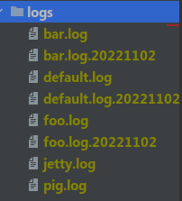
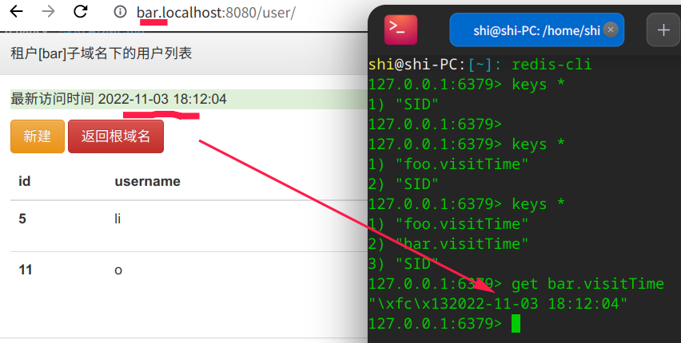
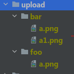
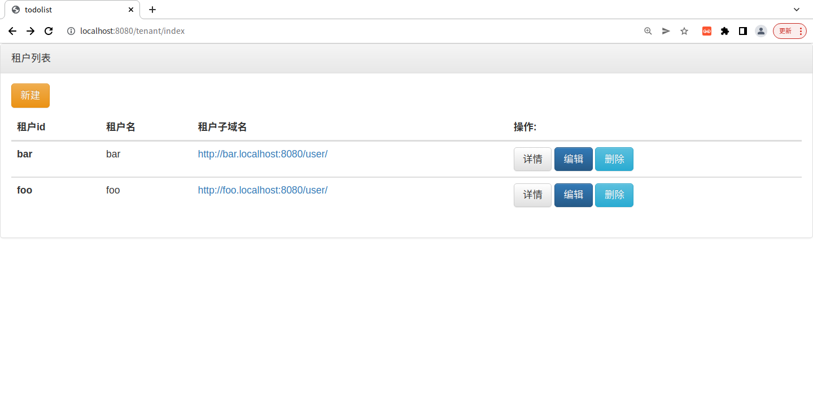
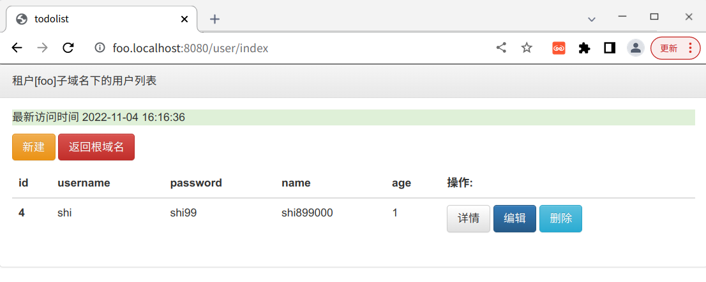
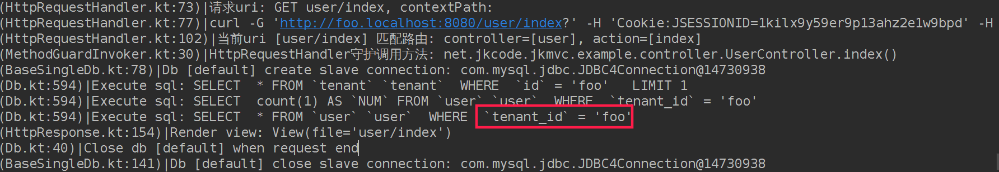

[GitHub](https://github.com/shigebeyond/tenancy) | [Gitee](https://gitee.com/shigebeyond/tenancy) 

基于 [jkmvc](https://github.com/shigebeyond/jkmvc) 框架的多租户实现，主要包含租户识别、日志隔离、db隔离、缓存隔离、文件系统隔离、分库等功能，还有一个web demo项目。

- 注: 依赖最新的jkmvc框架

## 1 租户信息类
参考 [TenantModel](src/main/kotlin/net/jkcode/jkmvc/tenancy/TenantModel.kt)

在使用本框架进行多租户应用开发时，需要根据实际业务需求，改写并覆盖`TenantModel`类

## 2 识别租户id
### 2.1 思路
1. 从二级域名中识别：
我们可以为每一个租户提供一个唯一的二级域名，通过二级域名就可以达到识别租户的能力;
如tenant1.example.com,http://tenant2.example.com， 而tenant1和tenant2就是我们识别租户的关键信息。
2. 从url片段中识别：
一般是用路由参数中某个参数作为租户标识
3. 从请求参数中识别：
将租户信息作为请求参数传递给服务端，为服务端识别租户提供支持；
如saas.example.com?tenantId=tenant1,saas.example.com?tenantId=tenant2。其中的参数tenantId就是应用程序识别租户的关键信息。
4. 从请求头中识别：
在请求头（Header）中设置租户信息，例如JWT等技术，服务端通过解析Header中相关参数以获得租户信息。
5. 从session中识别
在用户成功登录系统后，将租户信息保存在Session中，在需要的时候从Session取出租户信息。

### 2.2 实现
1. 默认识别方式是`二级域名`: 实现参考 [HttpServerTenantInterceptor](src/main/kotlin/net/jkcode/jkmvc/tenancy/HttpServerTenantInterceptor.kt) 与 [DomainTenantResolver](src/main/kotlin/net/jkcode/jkmvc/tenancy/resolver/DomainTenantResolver.kt)

2. 其他识别方式自行修改配置: [tenant.yaml](src/main/resources/tenant.yaml) 中的配置项 

3. 获得当前的租户: `TenantModel.current()`

## 2.3 关于域名
1. 有2类域名: 1 中央应用的域名(管理所有租户) 2 每个租户对应的业务应用子域名 

2. 开发环境中，我们可以使用`*.localhost`域名来应对多租户, 如`bar.localhost`/`foo.localhost`, 在大部分系统中等价于`localhost`域名

## 3 日志隔离
使用logback的`ch.qos.logback.classic.sift.SiftingAppender` 来实现不同租户打不同的日志文件, 效果如下：



其中`default.log`是中央应用的日志文件, `foo.log`/`bar.log`等是对应租户的日志文件

## 4 db隔离
### 4.1 思路
多租户在db隔离的实现上主要有三种方式：
1. 独立数据库
2. 同一数据库，不同表
3. 同一数据库，同一张表，通过字段（租户id）来区分

### 4.2 实现
本项目的实现是第3种, 参考 
1. [ISaasModel](src/main/kotlin/net/jkcode/jkmvc/tenancy/ISaasModel.kt): 创建记录时, 添加租户id字段值
2. [SaasOrmMeta](src/main/kotlin/net/jkcode/jkmvc/tenancy/SaasOrmMeta.kt): 查询时, 添加过滤租户id的条件

### 4.3 使用
参考例子[UserModel](src/main/kotlin/net/jkcode/jkmvc/example/model/UserModel.kt)
```
class UserModel(id:Int? = null): Orm(id), ISaasModel {
	
	companion object m: SaasOrmMeta(UserModel::class, "用户模型", "user", "id")
	
	...属性方法定义...
	
}
```

## 5 缓存隔离
实现参考 [TenantCache](src/main/kotlin/net/jkcode/jkmvc/tenancy/TenantCache.kt)

使用
```
val cache = TenantCache.instance("jedis")
cache.put("visitTime", Date().format(true))
cache.get("visitTime")
```

效果如下：


## 6 文件系统隔离
主要通过修改`net.jkcode.jkmvc.http.MultipartRequest.uploadSubDir`属性, 来实现不同租户对应不同的上传子目录

效果如下：



## 7 分库的实现
db隔离中我们采用第三种隔离方式：同一数据库，同一张表，通过字段（租户id）来区分；

但随着租户多起来，租户的数据多起来，必然会引入多db，这就引申出怎么将不同的租户数据分配到不同的db中？当然为了保证一致性，一个租户的数据还是放到同一个db;

本框架的实现方式:
1. 修改配置: [tenant.yaml](src/main/resources/tenant.yaml) 中的配置项`dynDb`改为true
2. 自行实现获得动态db名的方法: 在 [TenantModel](src/main/kotlin/net/jkcode/jkmvc/tenancy/TenantModel.kt) 类改写父类方法 [ITenant.dynDbName()](src/main/kotlin/net/jkcode/jkmvc/tenancy/ITenant.kt)；
关于实现方式，如直接新建一个存储字段`dbName`来返回, 如按租户id首字母范围分3段对应3个db, 如hash(租户id)%3 ...根据具体业务与设计来定。

## 8 demo
本项目中包含一个demo，来演示如何使用本框架来实现多租户网站

### 8.1 代码
[后端代码](src/main/kotlin/net/jkcode/jkmvc/example)
[前端代码](src/main/webapp)
[sql](src/main/resources/example.mysql.sql)

### 8.2 首页-租户列表
http://localhost:8080/



### 8.3 某个租户对应的二级域名-租户[foo]下的用户列表
http://foo.localhost:8080/user/index


通过日志，我们可以看到用户列表的查询sql是加上了租户id的过滤条件


同理，增删改查都会加上租户id的字段或条件，请自行搭建试验